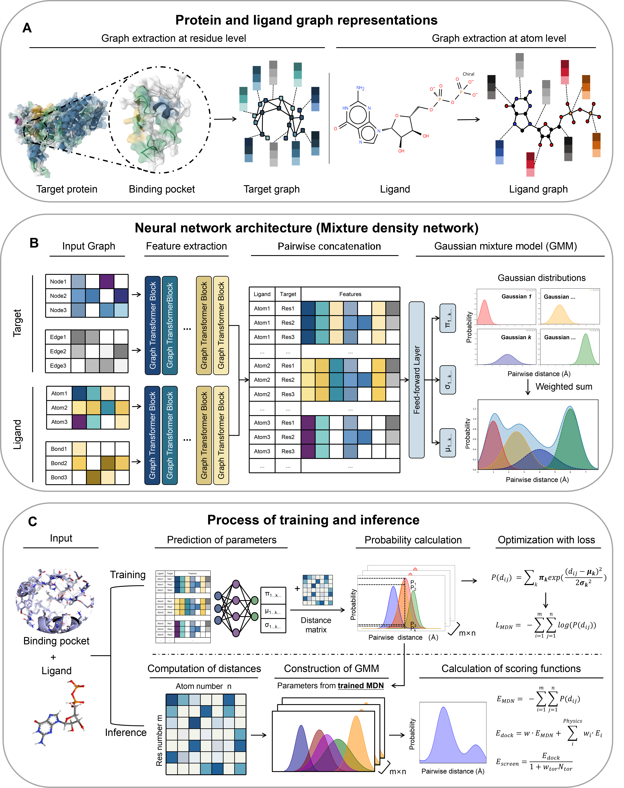
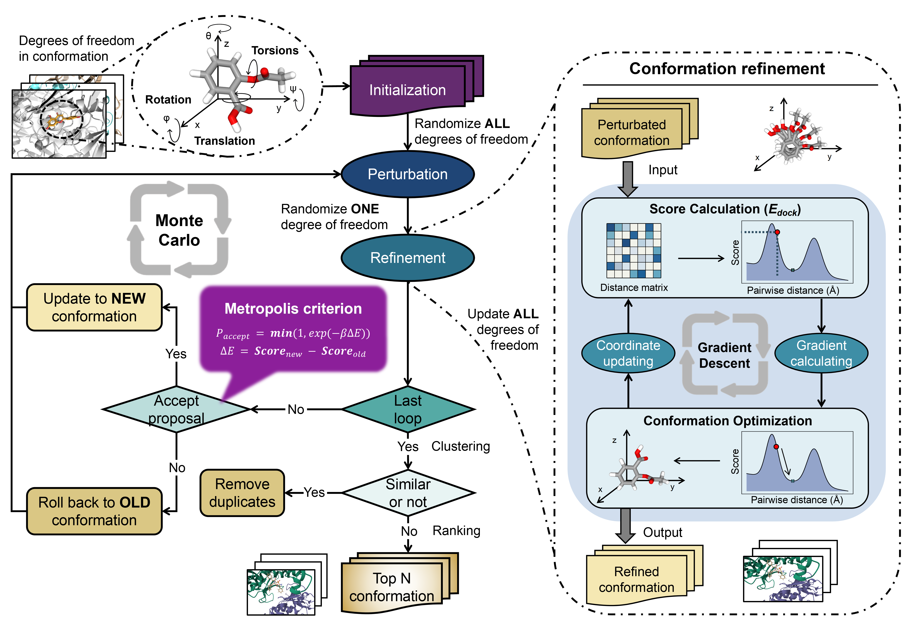

TRIDS Release Notes
============
#### TRIDS: AI-native molecular docking framework unified with binding site identification, conformational sampling and scoring

By Xuhan Liu & Hong Zhang, on JUN 26th 2026

Please see the LICENSE file for the license terms for the software. Basically it's free to academic users. If you do wish to sell the software or use it in a commercial product, then please contact us:

   [Xuhan Liu](mailto:xuhan.liu@xtalpi.com) (First Author): xuhan.liu@xtalpi.com 

   [Hong Zhang](mailto:zhangh@pku.edu.cn) (Correspondent Author): zhangh@pku.edu.cn 

## Introduction

Molecular docking is a cornerstone of drug discovery for unveiling the mechanism of ligand-receptor interactions. With the recent advances of deep learning (DL) in the field of artificial intelligence, innovative methods for molecular docking have achieved higher accuracy for binding pose prediction and virtual screening compared with classical physics-based methods. However, these DL-based methods not only consume huge computational resources, but also lack physics-based validity, which hinders their applicability to high-throughput virtual screening in reality. At present, there is a scarcity of approaches to strike a balance among accuracy, computational efficiency, and rigorous physical validity of the output conformations. In the first two versions of DSDP, we demonstrated the effectiveness of guiding conformational sampling with the gradient of an analytic scoring function. As the third version, TRIDS was devised as an AI-native docking framework that expand this sampling strategy to DL-based scoring model for unification of sampling and scoring processes. Furthermore, it is tailored for seamless cooperation of AI and physics to guarantee the physical validity of predicted binding poses. To be user-friendly, TRIDS is able to predict the binding site, parse multiple file formats, and supports Python programming and PyMOL graphical interaction. It has shown that our proposed method achieves excellent docking accuracy and passes physical validation with superior computational efficiency, i.e. a single docking task is done in sub-second while maintaining a highly lightweight GPU memory footprint of merely hundreds of megabytes. As a proof of concept, TRIDS has succeeded in obtaining hit compounds with novel scaffolds for tumor necrosis factor-alpha (TNFα) inhibitor through a large-scale virtual screening.

## Architectures

TRIDS is implemented with PyTorch C++ (LibTorch). It combined multiple optimization of streams parallel computing，CUDA graph-operator merge, automatic differentiation, CUDA kernel function to accelerate the program dramatically. General speaking, any differentiable ML-based scoring function could be compatible with this framework for conformational sampling.

### 1. Scorging Function 

The main SF in the present work is the mixture density network (MDN), which consists of three key components: a feature extraction module, a feature concatenation module, and a feed-forward output layer. The graphs obtained from the previous step are processed by multiple Graph Transformer blocks to ensure that the processed node features contain not only information about an individual atom or residue in the molecule, but also information about the surrounding nodes. The resulting graphs are then pairwise-concatenated to model the interaction and fed into a feed-forward layer to parameterize a Gaussian mixed model.

### 2. Conformational Sampling

The sampling space is defined on the degrees of freedom for each molecule, including translation, rotation and torsion angles of rotatable bonds, the ranges of which are [box_min, box_max], [-π, π) and [-π, π), respectively. In the beginning, each copy of conformation was initiated with randomization of the degrees of freedom involved. During the computational loop, one variable was randomly perturbed to update the conformation at first. Subsequently, the updated conformation was optimized through the gradient descent method. Adam with learning rate 0.1 was used to update the variables, in which the above-mentioned ML-based scoring model was differentiated to provide gradients. At the end of each loop, the perturbation was accepted according to Metropolis criterion.

## Installation
To run the compiled **TRIDS**, some dependent packages need to be installed. You could create an new **Conda** environment with these required packages: 

### 1. Create a new Conda environment named "trids" 

For **Linux**:

      $ conda env create -f cmake/linux/env-126.yml (CUDA 12.6)

or 

      $ conda env create -f cmake/linux/env-118.yml (CUDA 11.8)

For **windows**:

      $ conda env create -f cmake/windows/environment.yml (CUDA 12.6)

After installation, activate the Conda environment **trids**:

      $ conda activate trids

**Note:** 
* After this environment is created, all of required packages will be installed automatically.
* Make sure all of the dependencies have been installed. otherwise, you have to install them manually.
* If your CUDA version is 11.8, and default version of GCC  >= 12, you have to install another GCC (version: 11.2) with Conda

#### The following packages are required at runtime: 
#### 1.1. [PyTorch](https://www.pytorch.org) (version >= 2.6)

For CUDA 11.8:

      $ pip install pytorch==2.7.1 --index-url https://download.pytorch.org/whl/cu118

For CUDA 12.6:

      $ pip install pytorch==2.7.1 --index-url https://download.pytorch.org/whl/cu1126

#### 1.2. [OpenBabel](https://openbabel.org) (version >= 3.1.1)

      $ conda install openbabel==3.1.1 -c conda-forge

#### 1.3. [CLI11](https://github.com/CLIUtils/CLI11) (version >= 2.0)

      $ conda install cli11==2.1.2

#### 1.4. [spdlog](https://github.com/gabime/spdlog) (version >= 1.0)

      # conda install spdlog==1.16.0

#### 1.5. [pybind11](https://github.com/pybind/pybind11) (version >= 2.11, Optional)

      $ conda install pybind11==2.11 -c conda-forge

**Note**: Pybind11 is required only when you want to install **Python** version

#### 1.6 [PyMOL](https://www.pymol.org/) (version >= 2.5, Optional)

      $ conda install pymol-open-source -c conda-forge

**Note**: If you want to use PyMOL plugins, make sure that PyMOL and TRIDS has been installed in the same Conda environment.

#### The following packages are also required if this project is recompiled manually:
#### 1.7. [cmake](https://cmake.org) (version >= 3.18, < 4.0)

      $ conda install cmake==3.22 -c conda-forge

#### 1.8. [Nvidia CUDA](https://developer.nvidia.com/cuda) (version >= 11.8)

      $ conda install cuda==11.8.0 -c nvidia/label/cuda-11.8.0

or 

      $ conda install cuda==12.6.0 -c nvidia/label/cuda-12.6.0

**Note**: The version of PyTorch should be consistent with the version of CUDA. 

#### 1.9. [GCC](https://gcc.gnu.org/) (version <= 11.2, Optional)

      $ conda install gcc_linux-64==11.2 gxx_linux-64==11.2

**Note**: If your CUDA version is 11.8, and default GCC version >= 12, this GCC is required to be installed as C++ compiler.

### 2. Install standalone version on **Linux**

      $ mkdir build && cd build

      $ cmake ../cmake/linux -DCMAKE_INSTALL_PREFIX=<path/for/trids>

      $ make install -j 8

      $ export PATH=$PATH:<path/for/trids>/bin

**Note:** 
* **-DBUILD_PYTHON** for **cmake** is set to **ON**, if the **PyTrids** will be installed later manually; default is **OFF**;
* **-DCMAKE_INSTALL_PREFIX** is folder path for installation, please replace **<path/for/trids>** with appropriate location; default is **/usr/local**
* **-j 8** means that the code will be compiled with **eight** CPU cores, this number could be set manually based on your own device.

### 3. Install standalone version on **Windows**

      > cmake/windows/build.bat

**Note:**
* Make sure that you have already installed **Microsoft Visual C++ Build Tools**

* Make sure that you have already installed **Nvidia CUDA Toolkit**

* Compilation on Windows also depends on Ninja, so it should also be installed:
  
      > conda install ninja

* Add the **PATH** to environment variables:

      > set PATH=%CONDA_PREFIX%\Lib\site-packages\torch\lib;%CONDA_PREFIX%\Library\bin;%PATH%

### 4. Install **PyTrids** for Python

      $ mkdir build

      $ python setup.py install

**Note:**
* If you want to uninstall this package, run:

      $ pip uninstall trids

* Generally, the library and execution file have be precompiled in **bin/**. If compatibility issues occurs, delete the folder **bin/** before reinstallation.

      > rmdir /s /q bin/                  (on Windows)

or 

      $ rm -rf bin/                       (on Linux)

* If **llvm-openmp** has been installed in this **Conda** environment, the openmp library loading will clash on **Windows**. Therefore, you have to either uninstall this package manually, or set the following environmental variable.

      > set KMP_DUPLICATE_LIB_OK=TRUE

### 5. Install PyMOL plugin (After Step 4)
First of all, make sure that **PyTrids** and **PyMOL** has been installed in the same **Conda** environment

**Method 1**: (Recommended)
> * Run PyMOL
> * Menu: Plugin -> Plugin Manager -> Install New Plugin -> Choose File ...
> * Choose: ~/plugins/pymol/trids_gui.py
> * Restart PyMOL
> * If installation is complete, the menu in plugin has "TRIDS Settings"

**Method 2**: (Manual)
Copy trids_gui.py into the startup folder of PyMOL:
  
      $ cp plugins/pymol/trids_gui.py ~/.pymol/startup/                               (For Linux / MacOS)

or

      $ copy plugins/pymol/trids_gui.py C:\Users\<Username>\.pymol\startup\           (Windows)

**Method 3**: (Temporary) 
Run the following code in the command line of PyMOL

      PyMOL> run ~/plugins/pymol/trids_gui.py

### 6. Installation Check

      $ trids -h

Optionally, also check **PyTrids** if installed:

      $ python tests/test_trids.py -g 0 (CUDA)
      $ python tests/test_trids.py -g -1 (CPU)

**Note:** 
* If you could run **trids** from terminal, it has been installed successfully.
* If python outputs the correct information, it has worked normally. Here, **-g** denotes the CUDA id.

## Usage
### 1. Usage of standalone version: 

    $ trids -r <receptor_path> -l <ligand_path> [-k <refrence_ligand_path>] [OPTIONS]

Options:

    -h,--help                             Print this help message and exit
  
    -r,--receptor <pdb>                   Rigid part of the receptor [REQUIRED]
  
    -l,--ligand <smi, mol2, sdf, pdb>     Ligand [REQUIRED]
  
    -k,--pocket <pt, pth, mol2, sdf, pdb> Reference profile for Binding site identification
  
    --hts                                 High throughput screening mode with higher virtual screening accuracy but lower binding pose accuracy
  
    -o,--out <string>                     File path for outputing docking results, the format of molecules is based on file extension
  
    -e,--stream <uint> [256]              Max number of sampling for Monte carlo research
  
    -d,--depth <uint> [32]                Max depths for Monte carlo research
  
    -t,--top <uint> [1]                   Record Number of N best conformers in output
  
    --seed <uint>                         User defined random seed
  
    -c,--cpu <uint> [1]                   Number of CPU cores
  
    -g,--cuda <int> [0]                   Index of Nvidia CUDA Device. If set to -1, no CUDA device will be used
  
    --score_only                          Only calculating the score of given conformation without sampling

    -v,--verbose <0,1,2> [0]              Verbose mode, print more information, 0: Error, 1: Warning, 2: Info
  
    --config                              Read an ini file

**Note:** 
* For **C++** version, the compiled program **trids** is in the **./bin** file. You have to set it to your **$PATH** manually. 
* For **Python** version, you could run **trids** directly, as long as the **Conda** envrionment of "trids" is activated.

### 2. Usage in PyMOL
To make sure the correct usage of PyMOL plugin, users should run this program with two steps:
1. runing "trisite" to extract the binding site from the interested protein
2. runing "triscore" or "trids" with the binding site object generated by "trisite"
   
#### 2.1. If you want to predict the binding sites, run:

      PyMOL> trisite receptor [, reference [, cutoff [, show ]]]

Options:

      receptor    = str:      PyMOL selection as the receptor
      reference   = str:      (optional) reference ligand for pocket definition
      cutoff      = float:    pocket radius in Angstrom (default: 8.0)
      show        = 0/1:      auto-visualize pockets in PyMOL (default: 1)

#### 2.2. If you want to calulate the docking score of the ligand with the given binding site, run:

    PyMOL> triscore pocket, ligand [, use_vina ]

Options:

      pocket      = str:      PyMOL selection generated by trisite
      ligand      = str:      PyMOL selection as the ligand
      use_vina    = 0/1:      use Vina scoring (default: 0)

#### 2.3. If you want to dock the ligand to the given binding site, run:

      PyMOL> trids pocket, ligand [, top_n [, streams [, depth [, use_vina [, name ]]]]]

Options:

      pocket      = str:      PyMOL selection generated by trisite
      ligand      = str:      PyMOL selection as the ligand
      top_n       = int:      number of top conformations to return (default: 1)
      streams     = int:      number of parallel sampling tasks (default: 256)
      depth       = int:      Monte Carlo search depth (default: 32)
      use_vina    = 0/1:      use Vina scoring function instead of TRI (default: 0)
      name        = str:      base name for loaded result objects (default: trids_dock)

#### 2.4 If you want to get/set the runing device, run:

      PyMOL> tridev [dev, num]

Options:

      dev         = str:      computing device: either "gpu" or "cpu"
      num         = int:      If "gpu", it is gpu id, otherwise, it is number of cores.

## Aknowledgements
1. Shenzhen Bay Laboratory
2. Westlake University
3. Changping Laboratory
4. Peking University
5. XtalPi Technologies Co., Ltd

## References
1. [Liu X, Bonghua Zhang, Hong Zhang, Yi Qin Gao. TRIDS: AI-native molecular docking framework unified with binding site identification, conformational sampling and scoring. (2025). preprint](https://arxiv.org/abs/2510.24186)

2. [Chengwei Dong, Yu-Peng Huang, Xiaohan Lin, Hong Zhang, and Yi Qin Gao. DSDPFlex: Flexible-Receptor Docking with GPU Acceleration. (2024) Journal of Chemical Information and Modeling](https://doi.org/10.1021/acs.jcim.4c01715)

3. [YuPeng Huang, Hong Zhang, Siyuan Jiang, Dajiong Yue, Xiaohan Lin, Jun Zhang, and Yi Qin Gao. DSDP: A Blind Docking Strategy Accelerated by GPUs. (2023) Journal of Chemical Information and Modeling](https://pubs.acs.org/doi/10.1021/acs.jcim.3c00519)

